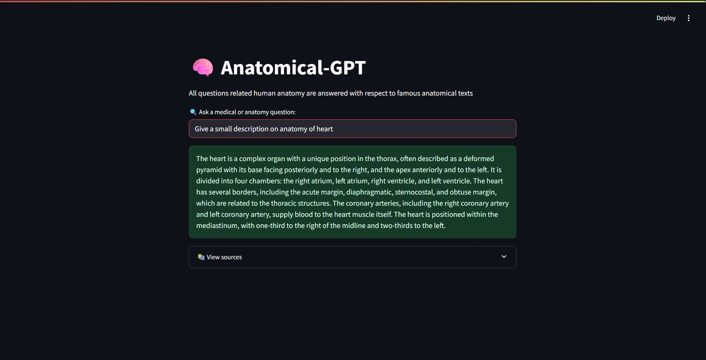
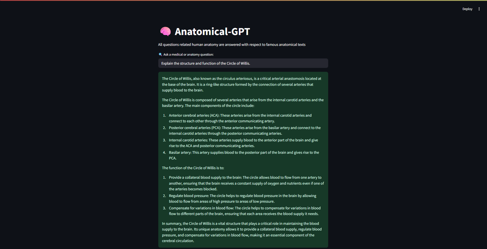
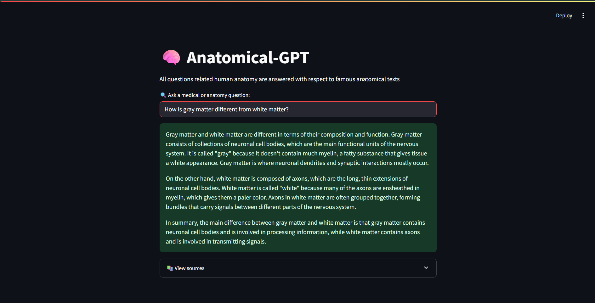
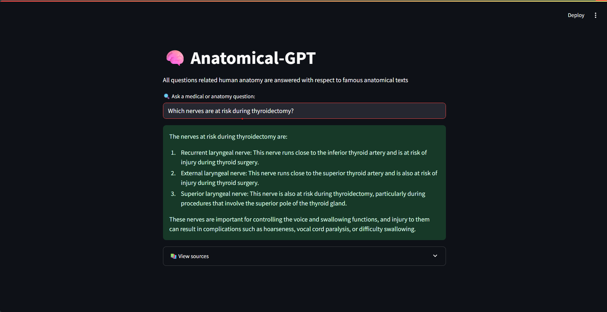

<h1 align="center">🧬 Anatomical GPT</h1>
<h3 align="center">An AI-Powered Medical Assistant Trained on Real Anatomy Textbooks</h3>
<h3 align="center"><a href="https://anatomical-gpt.streamlit.app/">Check out the project here!</a></h3>
<p align="center">
  <i>Built using RAG + FAISS + BioBERT + Groq LLaMA3</i>
</p>


Anatomical GPT is a **Retrieval-Augmented Generation (RAG)** chatbot that answers **medical/anatomy-related queries** using trusted textbook PDFs like *Gray’s Anatomy*, *Sobotta*, and *Clinically Oriented Anatomy*. It uses **BioBERT for embeddings** and **Groq-hosted LLMs (e.g., LLaMA3)** for ultra-fast inference.

## 🔍 What is RAG (Retrieval-Augmented Generation)?

**RAG (Retrieval-Augmented Generation)** is a powerful technique that enhances large language models by combining:

- 📚 **Retrieval**: It first searches a document store (like medical textbooks in our case) to fetch relevant content.
- 🧠 **Generation**: It then uses a language model (such as LLaMA 3 or Mixtral via Groq) to generate accurate, informed, and context-aware answers using the retrieved content.

---

## 🚀 How RAG Powers Anatomical GPT

In **Anatomical GPT**, RAG enables the chatbot to:

- 🔎 **Access up-to-date medical knowledge** from detailed anatomy textbooks instead of relying solely on the model's internal knowledge.
- 📖 **Answer complex medical/anatomy questions** with high relevance and factual grounding.
- ✅ **Reduce hallucinations** by only generating answers based on trusted retrieved documents.
- ⚡ **Work efficiently** using Groq-hosted models for low-latency response times.

This makes the chatbot far more reliable for users seeking detailed anatomical insights — combining the best of retrieval and generation to support real-world medical queries.

---

## 📁 Project Structure

```bash
.
├── app/                            # Streamlit UI
│   └── app.py
├── scripts/
│   ├── step1_extract_chunks.py    # Load PDFs and create chunks
│   ├── step2_create_vectorstore.py # Embed and store FAISS vectors
│   └── step3_chatbot_groq.py      # Groq LLM + QA chain
├── vectorstore/                   # FAISS index (gitignored)
├── Dataset/                       # PDF textbooks (gitignored)
├── .env                           # Store your GROQ_API_KEY here
├── .gitignore
├── requirements.txt
└── README.md
```
## 🧠 Model & Pipeline Details

| Component          | Description                                                                                         |
|-------------------|-----------------------------------------------------------------------------------------------------|
| **Embedding Model** | [`pritamdeka/BioBERT-mnli-snli-scinli-scitail-mednli-stsb`](https://huggingface.co/pritamdeka/BioBERT-mnli-snli-scinli-scitail-mednli-stsb) <br> Optimized for medical + scientific NLI & semantic tasks |
| **Vector Database** | FAISS (Facebook AI Similarity Search) - used to store and retrieve chunk embeddings efficiently    |
| **Text Splitter**   | `RecursiveCharacterTextSplitter` - breaks large PDF pages into ~500 token overlapping chunks       |
| **LLM (Groq-hosted)** | `llama3-70b-8192` or `mixtral-8x7b-32768` via `ChatGroq` LangChain wrapper                         |
| **Retriever**       | Top-k similarity-based chunk retriever from FAISS (k=5)                                             |
| **RAG Chain**       | `RetrievalQA` from LangChain - injects retrieved context into the prompt for question answering    |
| **Frontend**        | Streamlit - lightweight Python-based web UI for user queries                                       |

## 📚 Books Used for Medical Knowledge Base

The chatbot uses content from the following comprehensive and authoritative anatomy textbooks:

| Book Title | Description |
|------------|-------------|
| **Clinically Oriented Anatomy** <br> *by Keith L. Moore* | A widely used anatomy textbook that bridges the gap between basic anatomy and clinical practice. It emphasizes the relevance of anatomy to clinical medicine and includes case studies and illustrations. |
| **Gray's Anatomy: The Anatomical Basis of Clinical Practice** | A classic and detailed reference in human anatomy, often considered the gold standard. It covers anatomical structures with clinical relevance, dissection guidance, and illustrations. |
| **Sobotta Atlas of Human Anatomy – Volume 1 & 2** | These volumes provide detailed anatomical illustrations and concise explanations. Volume 1 focuses on the head, neck, and neuroanatomy, while Volume 2 covers the thorax, abdomen, pelvis, and limbs. Ideal for medical students preparing for exams and clinical practice. |


## 🔄 Workflow Algorithm: Anatomical GPT

This section outlines the step-by-step flow that powers the RAG-based Anatomical GPT chatbot.

---

### 🧩 Step 1: Load and Process PDFs

1. **Input**: Medical textbooks in PDF format (e.g., Gray’s Anatomy, Sobotta, Clinically Oriented Anatomy).
2. **Loader**: Use `PyPDFLoader` (from LangChain) to extract text from each page.
3. **Storage**: All text is collected into `Document` objects.

---

### ✂️ Step 2: Chunking the Text

1. **Splitter**: Use `RecursiveCharacterTextSplitter` to divide long documents into manageable ~500-token chunks.
2. **Overlap**: Maintain a chunk overlap (e.g., 100 tokens) to preserve context between adjacent chunks.
3. **Output**: A list of small, coherent text chunks ready for embedding.

---

### 🧠 Step 3: Create Embeddings and Store Vectors

1. **Embedding Model**: Use `HuggingFaceEmbeddings` with a biomedical model (e.g., BioBERT).
2. **Vector Store**: Store embeddings using `FAISS` for fast retrieval.
3. **Persistence**: Save FAISS index to disk for reuse without re-embedding.

---

### 🔍 Step 4: RAG-based Query Answering

1. **Retriever**: When a user asks a question, relevant text chunks are retrieved from FAISS using vector similarity.
2. **LLM**: The retrieved context is passed to a Groq-hosted model (e.g., LLaMA 3 or Mixtral).
3. **Answer Generation**: The model generates a grounded answer using both the prompt and retrieved context.

---

### 🖥️ Step 5: Streamlit Chat UI

1. **Input**: User enters medical/anatomy question.
2. **Backend Call**: Streamlit sends the question to the RAG pipeline.
3. **Display**: Answer is shown in the interface, along with optional source documents for transparency.

---
## Demo images:




---

### ✅ Benefits

- Real-time responses.
- Trusted sources from medical textbooks.
- Low-latency Groq inference.
- Context-aware and hallucination-resistant answers.
---

## 🙌 Contributing

We welcome contributions from developers, researchers, and medical professionals to improve Anatomical GPT. If you'd like to help improve accuracy, add features, or suggest better datasets, feel free to fork the repo and submit a pull request.

---

## 📚 Future Enhancements

- 🔍 Incorporate more medical domains like pathology and pharmacology.
- 🗣️ Add voice input/output for accessibility.
- 🌐 Deploy as a web service or API for public use.
- 🧪 Fine-tune on custom QA datasets for better specificity.

---

## 💬 Feedback & Support

If you find any issues or have suggestions for improvements, feel free to open an issue or reach out. Your feedback helps us make this project more useful to the community.

---

## 🧠 Made with RAG & Groq

This project combines the power of Retrieval-Augmented Generation (RAG) with blazing-fast inference from Groq LLMs to deliver trusted, medically grounded answers sourced directly from expert anatomy texts.

---

## ⭐️ Star This Repo

If you found this project helpful, consider giving it a ⭐️ on GitHub to show your support!

---

## 📄 License

This project is licensed under the MIT License. See [LICENSE](LICENSE) for details.
